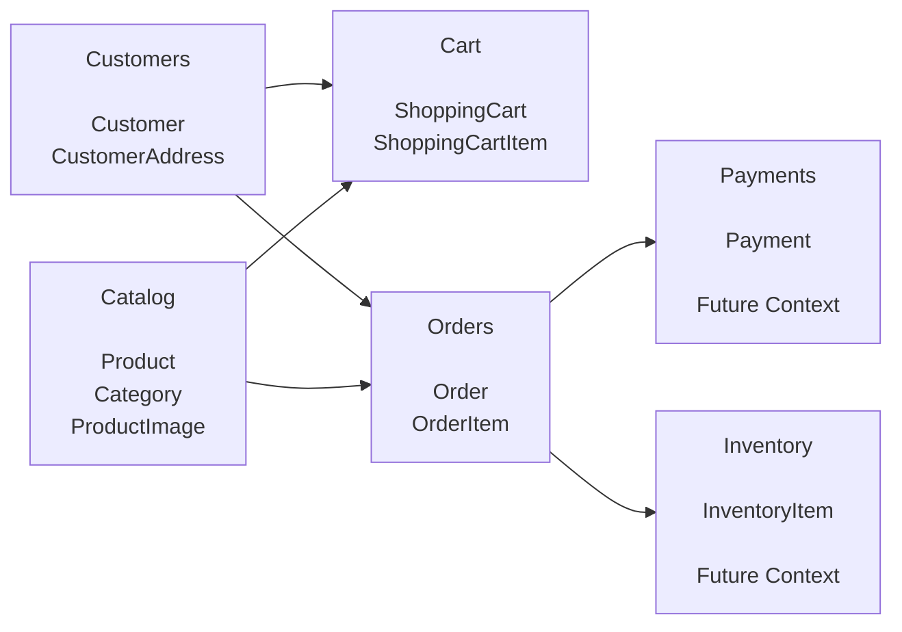

# Bounded Contexts

## Purpose

This diagram defines the primary bounded contexts of the Ecommerce Store domain.

These contexts establish aggregate ownership and business boundaries.

---

## Context Map



---

## MVP Contexts

Implemented in Version 1:

```text
Catalog

Customers

Cart

Orders
```

---

## Deferred Contexts

Planned for future releases:

```text
Payments

Inventory

Shipping

Promotions

Reviews
```

---

## Aggregate Roots

### Catalog

```text
Product

Category
```

---

### Customers

```text
Customer
```

---

### Cart

```text
ShoppingCart
```

---

### Orders

```text
Order
```

---

### Payments

```text
Payment
```

Future implementation.

---

### Inventory

```text
InventoryItem
```

Future implementation.

---

## Aggregate Interaction Rule

Aggregates communicate using identifiers.

Preferred:

```csharp
public Guid CustomerId { get; private set; }

public Guid ProductId { get; private set; }
```

Avoid:

```csharp
public Customer Customer { get; private set; }

public Product Product { get; private set; }
```

This preserves aggregate boundaries and transactional consistency.

---