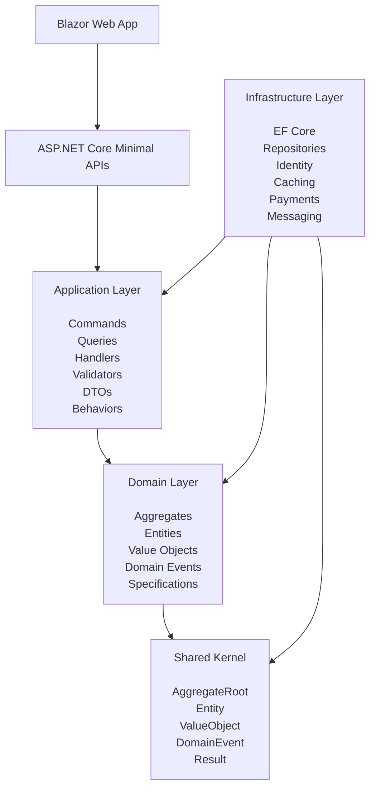

# Clean Architecture

## Purpose

This diagram illustrates the architectural layers of the Ecommerce Store application.

Dependencies must flow inward.

Business rules are protected from framework concerns.

---

## Architecture Diagram

---

## Layer Responsibilities

### Web

Presentation.

Responsibilities:

- Rendering
- Component composition
- User interactions

---

### API

Application boundary.

Responsibilities:

- Requests
- Responses
- Authentication
- Authorization
- OpenAPI

---

### Application

Use-case orchestration.

Responsibilities:

- CQRS
- MediatR Handlers
- Validation
- DTO Mapping

---

### Domain

Business behavior.

Responsibilities:

- Invariants
- Rules
- State transitions
- Aggregate consistency

---

### SharedKernel

Reusable building blocks.

Responsibilities:

- Entity
- AggregateRoot
- ValueObject
- DomainEvent
- Result

---

### Infrastructure

Technical implementations.

Responsibilities:

- Persistence
- EF Core
- Identity
- External integrations

---