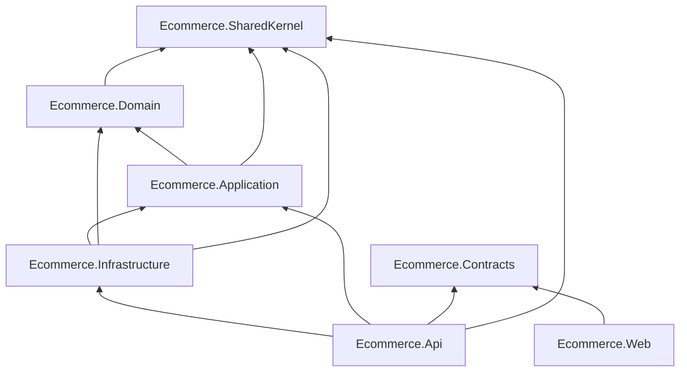

# Project Dependencies

## Purpose

This diagram defines the allowed project references within the solution.

Arrows indicate compile-time dependencies.

All project references must comply with this diagram and the rules defined in:

- dependency-rules.md

---

## Project Dependency Diagram

---

## Dependency Rules

### SharedKernel

Foundation of the solution.

May be referenced by:

- Domain
- Application
- Infrastructure
- API

Must not reference any solution project.

---

### Domain

May reference:

- SharedKernel

Must not reference:

- Infrastructure
- API
- Web

---

### Application

May reference:

- Domain
- SharedKernel

Must not reference Infrastructure implementations.

---

### Infrastructure

May reference:

- Application
- Domain
- SharedKernel

Contains implementations only.

---

### API

May reference:

- Application
- Infrastructure
- Contracts
- SharedKernel

Must remain thin.

---

### Web

May reference:

- Contracts

Communicates through APIs.

---